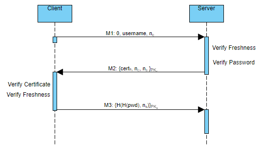
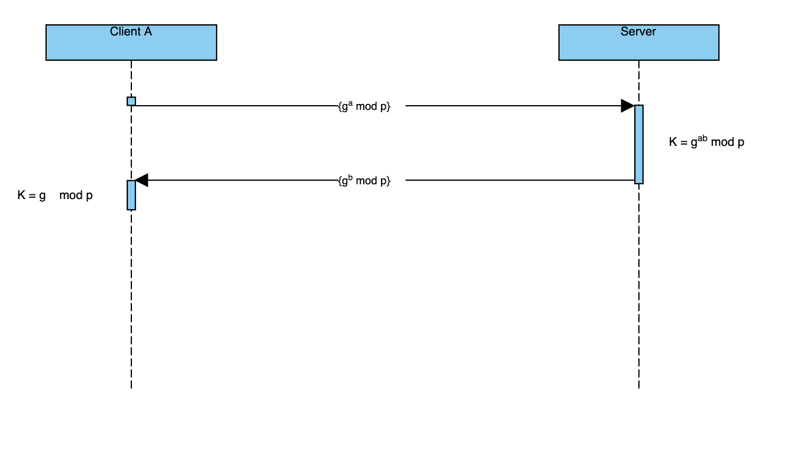
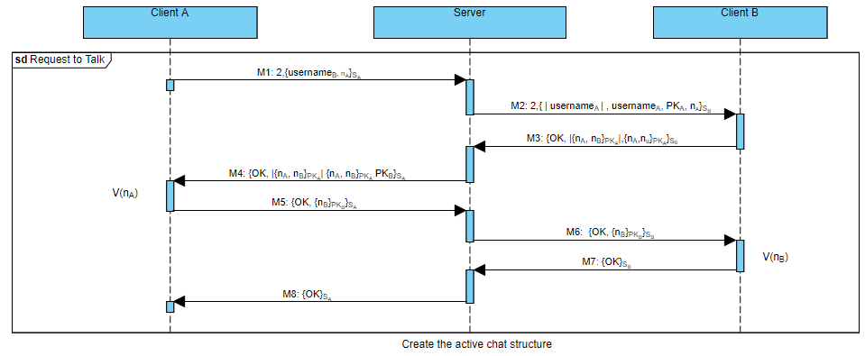
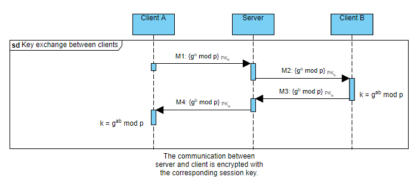

# Secure messaging

## Introduction

Secure messaging is a chatting application that offers confidentiality, integrity and reliability. It achieves confidentiality and integrity through authenticated encryption, whereas reliability with TCP communications.
Secure messaging works on Unix-like systems; we tested it on x86_64 Linux and intel/apple-silicon Mac.

## Server and client authentication

The messages are exchanged between two clients through the server, which acts as an intermediary. When the application starts, the server must authenticate using a certificate released by a trusted certification authority. Thanks to this certificate, the client can obtain the server's public key and be sure that the server is what we expect it to be. Once the server is authenticated, the client sends to it the credentials to perform the login. The username is in the clear, but the password is hashed and encrypted with the server public key. Passwords are in a file on the server: the usernames are in the clear, and the passwords are hashed. The messages contain nonces to avoid replay attacks.



### Message format

 ```
 // Message M1
---------------
|0|username|nc|
---------------

// Message M2
-------------------------------
|IV|encrypted_key|cert_s|nc|ns|
-------------------------------

// Message M3
-------------------------------
|IV|encrypted_key|H(H(psw),ns)|
-------------------------------
```

## Client-Server session key establishment

Once the client and server are authenticated, they establish a session key. The ephemeral Diffie-Hellman protocol is used to guarantee the perfect forward secrecy. First, the parameters "p" and "g" are generated. Then, the client generates the parameter "a", computes the public key and sends it to the server. The server generates the parameter "b", computes its public key and derives the shared secret. Later, it sends its public key to the client that, in turn, derives the secret. The messages are encrypted with the respective public key. In the end, they share a session key.




### Message format

 ```
// Message M1
-------------------------
|IV|encrypted_key|PKa_DH|
-------------------------

// Message M2
-------------------------
|IV|encrypted_key|PKb_DH|
-------------------------
```


## Request to talk

Before starting a chat with another user, a user must send him a request to talk, which can be accepted or not by the receiver. All the messages exchanged between client and server are encrypted with the established session key, as we have said in the previous paragraph. The request to talk protocol works in the following way:

1) CLIENT A -> SERVER: Client A sends a message to the server which has the user's username he wants to chat with and a nonce to guarantee freshness against replay attack. The request to talk has OPCODE = 2. The username and the nonce are encrypted.

2) SERVER -> CLIENT B: The server knows that it must forward a request to talk to client B, whose username is known from the message previously received and decrypted. The first 64 bits of the message are composed of the sender username length. Then, there are the username sender, its public key and the nonce. Everything but the OPCODE is encrypted.

3) CLIENT B -> SERVER: Client B can accept or refuse the request to talk sent by client A.  If the request is accepted, it sends an "OK" message with client A's nonce and its one. Nonces are encrypted with client A's public key. If the request is refused, client B sends a "NO" message.

4) SERVER -> CLIENT A: If an "OK" message is received, the server adds client B's public key, then forwards it to client A. If client B refused the request to talk, the server forwards the "NO" message to client A.

5) CLIENT A -> SERVER: Client A verifies the nonce. If verification is successful, it sends to the server an "OK" message with the nonces. Everything is encrypted with client B's public key. If client B refuses to talk, client A receives the "NO" message, and the protocol stops here.

6) SERVER -> CLIENT B: The server forwards the message.

7) CLIENT B -> SERVER: Client B receives the message and verifies the nonce. If verification is successful, it sends to the server an "OK" message.

8) SERVER -> CLIENT A: The server forwards the message to client A. At this point, the request to talk was successful.

At the end of this process, the server adds the two clients to an active chat structure to keep chatting, and the clients start a key exchange protocol.



### Message Format

 ```
 // Message M1
-----------------------
|2|IV|usernameB|na|TAG|
-----------------------

// Message M2
-----------------------------------------
|2|IV|usernameA_len|usernameA|PKa|na|TAG|
-----------------------------------------

// Message M3 (Request to talk accepted)
----------------------------------
|IV|OK|IV|encrypted_key|na|nb|TAG|
----------------------------------

// Message M3 - M4 (Request to talk refused)
-----------
|IV|NO|TAG|
-----------

// Message M4
-----------------------------------------------------
|IV|enc_nonces_len|OK|IV|encrypted_key|na|nb|PKb|TAG|
-----------------------------------------------------

// Message M5 - M6
----------------------------------
|IV|OK|IV|encrypted_key|na|nb|TAG|
----------------------------------

// Message M7 - M8
-----------
|IV|OK|TAG|
-----------
```

## Client A - Client B session key establishment

After a successful request to talk, client A and client B need to exchange a session key. The key exchange protocol is ephemeral Diffie-Hellman to provide perfect forward secrecy. In this description, the server is omitted because it only forwards the messages to the clients. The key exchange protocol works in the following way:

1) CLIENT A -> CLIENT B: Client A generates the "a" parameter, computes the public key "g^a mod p", and sends it to client B. Everything is encrypted with client B's public key.

2) CLIENT B -> CLIENT A: Client B receives client A's public key, generates the "b" parameter, computes the public key "g^b mod p", and derives the shared secret. Client B sends its public key to client A that derives the shared secret.

When the shared secret is established, the chat starts.

 ```
// Message M1 - M2
--------------------------------
|IV|IV|encrypted_key|PKa_DH|TAG|
--------------------------------

// Message M3 - M4
--------------------------------
|IV|IV|encrypted_key|PKb_DH|TAG|
--------------------------------
```



## Chat

The chat is **back and forth**: the first who can send a message is the one who sent the request to talk, in our example is the client A. Client B waits for a message from client A and, only after receiving it, it can reply.

## Miscellanea

- The communications are performed using TCP to guarantee its reliability.
- Each client can open a chat at a time. The server allows at most ten users online. It keeps a structure for the online users and a structure for the active chats.
- A user in an active chat can close the communication by typing "!deh". In this case, the server will forward the message to the other side and removes the chat from the active ones.
